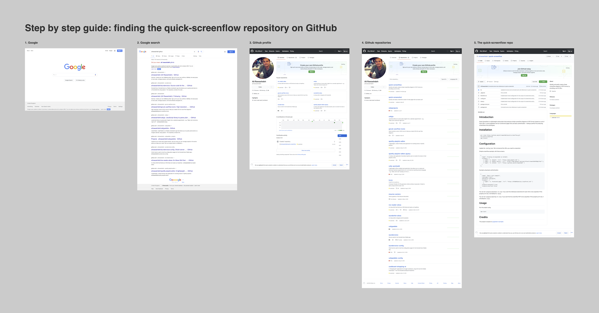

# Introduction 👋

Quick Screenflow is a lightweight node project that produces simple screenflow diagrams in PDF format, based on a set of input URLs. It uses puppeteer and can screenshot pages that use basic authentication - making it perfect for producing screenflows from prototypes.

Example output:



# Installation 📦

```
git clone https://github.com/alirawashdeh/quick-screenflow.git
cd quick-screenflow
npm install
```

# Configuration 🎚

Update the `config.json` file to include all the URLs you need to screenshot.

Simple screenflow example, with three screens:

```
{
  "name": "Step by step guide: finding the quick-screenflow repository on GitHub",
  "screens": [
    { "name": "1. Google", "url": "https://www.google.com" },
    { "name": "2. Google search", "url": "https://www.google.com/search?q=alirawashdeh%20github" },
    { "name": "3. Github profile", "url": "https://github.com/alirawashdeh" },
    { "name": "4. Github repositories", "url": "https://github.com/alirawashdeh?tab=repositories"},
    { "name": "5. The quick-screenflow repo", "url": "https://github.com/alirawashdeh/quick-screenflow"}
  ]
},
```

Example using basic authentication:

```
{
  "name": "Basic auth example",
  "username":"user",
  "password":"password",
  "screens": [
    { "name": "1. Protected page", "url": "https://dfdm943axhisa.cloudfront.net" }
    ],
  "outputscreenshots":true,
  "outputscreenflow":false
}
```
You can set `outputscreenshots` to `true` if you want the individual screenshots for each URL to be outputted. If this property isn't set, it will default to `false`.

You can set `outputscreenflow` to `true` if you want the the screenflow PDF to be outputted. If this property isn't set, it will default to `true`.

# Usage 🏃‍♀️

Run the project using:

```
npm start
```

Outputted files will appear in the root of the folder.

# Credits 👍
This project is based on
[puppeteer-examples](https://github.com/checkly/puppeteer-examples)
